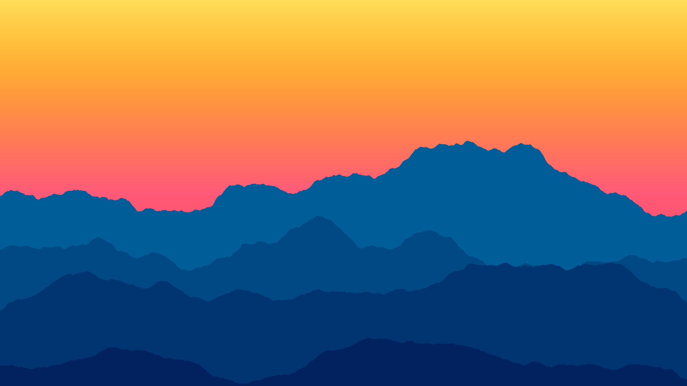
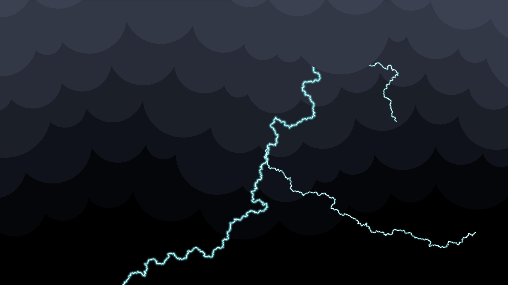

# Procedural Wallpaper Generators

A small collection of standalone Python scripts that procedurally generate
desktop wallpapers. Each script is self-contained, has a `CONFIG` section at
the top with every tweakable parameter, and saves its output as a PNG named
after the random seed used to generate it (so any image can be reproduced
by reusing that seed).

## Requirements

```bash
pip install -r requirements.txt
```

## Scripts

| Script | Description |
|---|---|
| [`mountain_range_sunset.py`](mountain_range_sunset.py) | A layered mountain range silhouette in front of a warm vertical sunset gradient. |
| [`thunder_storm.py`](thunder_storm.py) | A dark, layered storm-cloud scene with a glowing, branching lightning bolt. |

More generators will be added to this repository over time.

Run a script directly to generate an image:

```bash
python mountain_range_sunset.py
python thunder_storm.py
```

---

### `mountain_range_sunset.py`

Draws a vertical sky gradient (pink/red at the bottom fading to yellow at
the top) with several mountain silhouettes stacked in front of it,
back-to-front, each one darker and larger than the last. Mountain ridgelines
are built from 1D fractal (fBm) noise.



| Parameter | Description |
|---|---|
| `WIDTH`, `HEIGHT` | Output image dimensions in pixels. |
| `SKY_BOTTOM_COLOR`, `SKY_MID_COLOR`, `SKY_TOP_COLOR` | The three colors that make up the vertical sky gradient, from bottom to top. |
| `MOUNTAIN_COLOR_FAR`, `MOUNTAIN_COLOR_NEAR` | Colors for the farthest-back and closest mountain layers; layers in between are interpolated. |
| `NUM_MOUNTAINS` | How many mountain layers to draw. |
| `NOISE_OCTAVES` | Number of fBm noise octaves — more octaves add finer ridge detail/roughness. |
| `NOISE_PERSISTENCE` | How quickly noise amplitude shrinks per octave (0–1); lower is smoother. |
| `NOISE_LACUNARITY` | How quickly noise frequency grows per octave; higher packs bumps closer together. |
| `NOISE_BASE_FREQUENCY` | Base "zoominess" of the noise; higher means more bumps across the ridgeline. |
| `MOUNTAIN_BASE_Y` | Vertical position of each mountain's base, as a fraction of image height, from farthest to closest. |
| `MOUNTAIN_AMPLITUDE` | Height of each mountain's silhouette, as a fraction of image height, from farthest to closest. |

---

### `thunder_storm.py`

Builds a dark, banded storm-cloud backdrop, then composites a jagged lightning bolt (generated via fractal
midpoint displacement) with a soft glowing halo and optional branches,
breaking through the frontmost cloud bands.



| Parameter | Description |
|---|---|
| `WIDTH`, `HEIGHT` | Output image dimensions in pixels. |
| `CLOUD_COLOR_LIGHT`, `CLOUD_COLOR_DARK` | Endpoints of the cloud color gradient (lightest/frontmost to darkest/background) and canvas fill color. |
| `CLOUD_GAMMA` | Exponent applied to the cloud color gradient; `<1` darkens bands sooner, `>1` keeps them lighter longer. |
| `NUM_CLOUDS` | Number of cloud bands (layers) drawn across the image. |
| `CLOUD_CIRCLES` | Number of overlapping puff circles used to build one cloud band's silhouette. |
| `CLOUD_PUFFINESS` | How round/full each puff circle is; `1.0` is close to a full semicircle. |
| `CLOUD_PUFF_VARIETY` | Random variation in horizontal spacing between puffs within a band. |
| `CLOUD_NOISE_FREQUENCY` | Frequency of the noise used to perturb each band's vertical profile; higher wobbles faster across the width. |
| `CLOUD_NOISE_HEIGHT` | Multiplier on the per-band vertical noise displacement. |
| `CLOUD_VARIETY` | Scales how much each band samples a different "slice" of the noise field, so bands look distinct. |
| `LIGHTNING_COLOR` | Color of the lightning bolt's glow/halo. |
| `LIGHTNING_BREAKTHROUGH` | Number of frontmost cloud bands drawn on top of the bolt, so it appears to break through them. |
| `LIGHTNING_BRANCHES` | Number of branch bolts forking off the main strike. |
| `LIGHTNING_ROUGHNESS` | Scales the random displacement at each fractal subdivision; higher is more jagged. |
| `LIGHTNING_MIN_SEGMENT` | Minimum segment length (px) before subdivision stops; controls the finest bolt detail. |
| `LIGHTNING_HALO_WIDTH` | Width (px) of the bolt's glowing halo. |
| `LIGHTNING_ORIGIN` | x-coordinate at the top of the image where the bolt starts; `None` picks randomly. |
| `LIGHTNING_TARGET` | x-coordinate at the bottom of the image where the bolt ends; `None` picks randomly, biased opposite `LIGHTNING_ORIGIN`. |
